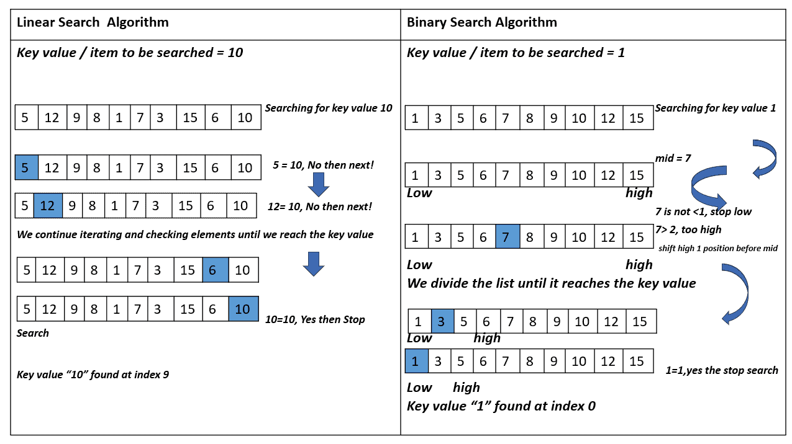

### Overview of Interpolation Search Algorithm

Interpolation search is an efficient algorithm for finding a specific value in a sorted array. It improves upon binary search by estimating the position of the target value based on the values of the elements in the array, making it particularly effective for uniformly distributed datasets.

### How It Works

1. **Initialization**: Define two pointers, `low` and `high`, which represent the current bounds of the search area.
2. **Probing**: Calculate the probable position of the target value using the formula:


   where K is the target value.

3. **Comparison**:
    - If `arr[index]` is equal to K, return the index.
    - If `arr[index]` is less than K, adjust the `low` pointer to `index + 1`.
    - If `arr[index]` is greater than K, adjust the `high` pointer to `index - 1`.

4. **Termination**: The process continues until the target is found or the search space is exhausted.

### Java Implementation

Here’s a Java implementation of the Interpolation Search algorithm:

```java
import java.util.Scanner;

public class InterpolationSearch {

    public static int interpolationSearch(int[] sortedArray, int toFind) {
        int low = 0;
        int high = sortedArray.length - 1;
        int mid;

        while (low <= high && toFind >= sortedArray[low] && toFind <= sortedArray[high]) {
            if (sortedArray[high] - sortedArray[low] == 0) {
                return (low + high) / 2; // Avoid division by zero
            }

            mid = low + ((toFind - sortedArray[low]) * (high - low)) / (sortedArray[high] - sortedArray[low]);

            if (sortedArray[mid] < toFind) {
                low = mid + 1;
            } else if (sortedArray[mid] > toFind) {
                high = mid - 1;
            } else {
                return mid; // Element found
            }
        }

        if (sortedArray[low] == toFind) {
            return low; // Element found
        } else {
            return -1; // Element not found
        }
    }

    public static void main(String[] args) {
        Scanner scan = new Scanner(System.in);
        System.out.println("Interpolation Search Test\n");

        System.out.println("Enter number of integer elements");
        int n = scan.nextInt();

        int[] arr = new int[n];
        System.out.println("\nEnter " + n + " sorted integer elements");
        for (int i = 0; i < n; i++) {
            arr[i] = scan.nextInt();
        }

        System.out.println("\nEnter element to search for: ");
        int key = scan.nextInt();

        int result = interpolationSearch(arr, key);
        if (result == -1) {
            System.out.println("\n" + key + " element not found");
        } else {
            System.out.println("\n" + key + " element found at position " + result);
        }
    }
}
```

---
### Interpolation Search Algorithm: Key Details

- **Requirements**:
    - The dataset must be **sorted**.
    - The dataset should ideally be **uniformly distributed** for optimal performance.

- **Time Complexity**:
    - **Best Case**: O(1) when the target element is found immediately.
    - **Average Case**: O(\log(\log(n))) for uniformly distributed data.
    - **Worst Case**: O(n) when the data is not uniformly distributed, potentially resembling linear search behavior.

- **Space Complexity**:
    - O(1) since it uses a constant amount of additional space regardless of input size.

- **When to Use Interpolation Search**:
    - **Uniformly Distributed Data**: It performs best when the data is evenly spread.
    - **Large Datasets**: More efficient than linear search for large arrays.
    - **Early Exit Scenarios**: Can quickly determine if the target is not present if it falls outside the bounds of the array.

- **When Not to Use Interpolation Search**:
    - **Non-Uniformly Distributed Data**: Performance degrades significantly with skewed distributions.
    - **Small Datasets**: For small arrays, the overhead of calculations may not justify its use over simpler methods like linear search.

- **Comparison with Binary Search**:
    - **Binary Search**:
        - Always checks the middle element, leading to O(\log(n)) time complexity.
        - Works effectively regardless of data distribution.
    - **Interpolation Search**:
        - Estimates the position based on the value of the target, which can lead to faster searches in uniformly distributed datasets.
        - If the target value is closer to the higher end of the array, it will search in that direction, potentially reducing the number of comparisons.

- **Use Cases**:
    - Ideal for applications where data is sorted and uniformly distributed, such as certain database queries or in-memory search operations where performance is critical.

### Conclusion

Interpolation search is a powerful algorithm for specific scenarios, particularly with large, uniformly distributed datasets. It can outperform binary search in these cases but should be avoided in non-uniform distributions or small datasets due to its potential inefficiencies. Understanding the strengths and weaknesses of both algorithms is essential for selecting the appropriate search method for a given problem.
