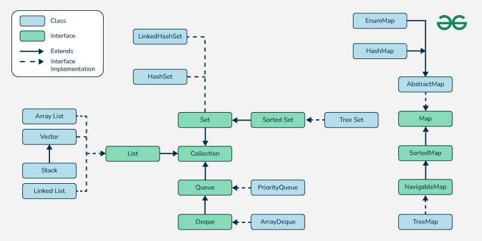

### **Title:** Java Collections Framework
**Tags:** #Java #CollectionsFramework #DataStructures #Algorithms #Interfaces #Classes #DSA #InterviewPreparation  
**Date:** [Date]

## **Description**
The Java Collections Framework (JCF) provides a unified architecture for representing and manipulating collections of data. This framework is essential for solving data structure and algorithm (DSA) problems efficiently. It includes interfaces, implementations (classes), and algorithms that allow developers to work with data structures like lists, sets, maps, and queues. In an interview context, understanding the Collections Framework is crucial because it involves both theoretical and practical knowledge of how data is managed and manipulated in Java.

### **Java Collections Framework Structure**
Here is a text-based diagram of the Java Collections Framework hierarchy to illustrate the relationships between the core interfaces and classes.


```plaintext
                           Collection (Interface)
                              /     |      \
                            /       |       \
                           /        |        \
                      List        Set       Queue
                     (I)          (I)        (I)
                    /  \          /  \        |
                   /    \        /    \       |
         ArrayList    LinkedList   HashSet  PriorityQueue
          (C)            (C)        (C)         (C)
                         |
                    Stack, Deque (I)
                          |
                  ArrayDeque, LinkedList (C)

                                 Map (I)
                                 /   \
                             HashMap TreeMap
                                (C)     (C)
```

- **Collection (I):** Root interface representing a group of objects.
- **List (I):** Ordered collection with positional access.
- **Set (I):** Collection that contains no duplicate elements.
- **Queue (I):** Collection used for holding elements prior to processing (FIFO/LIFO).
- **Map (I):** Collection of key-value pairs with unique keys.

**(I) -> Interface | (C) -> Class**

### **Core Interfaces and Their Methods**

#### **1. Collection Interface**
The `Collection` interface is the root interface for most collections. It defines the basic operations that all collection classes must implement.

**Important Methods:**
- `boolean add(E element)` - Adds an element to the collection.
- `boolean remove(Object element)` - Removes an element from the collection.
- `boolean contains(Object element)` - Checks if the collection contains a specific element.
- `int size()` - Returns the size of the collection.
- `void clear()` - Removes all elements from the collection.
- `boolean isEmpty()` - Checks if the collection is empty.
- `Iterator<E> iterator()` - Returns an iterator to traverse through the collection.

#### **2. List Interface**
The `List` interface extends the `Collection` interface and represents an ordered collection (also known as a sequence). It allows positional access and insertion of elements.

**Important Methods:**
- `void add(int index, E element)` - Inserts the element at the specified position.
- `E get(int index)` - Returns the element at the specified position.
- `E remove(int index)` - Removes the element at the specified position.
- `int indexOf(Object element)` - Returns the index of the first occurrence of the element.
- `int lastIndexOf(Object element)` - Returns the index of the last occurrence of the element.
- `List<E> subList(int fromIndex, int toIndex)` - Returns a view of the portion of this list.

**Common Implementations:**
- **`ArrayList` (C):** Resizable array implementation of the `List` interface. Fast random access, slower insertions/removals in the middle.
- **`LinkedList` (C):** Doubly linked list implementation. Fast insertions and deletions but slower random access.

**Example:**
```java
List<String> arrayList = new ArrayList<>();
arrayList.add("Apple");
arrayList.add("Banana");
String fruit = arrayList.get(1);  // Outputs "Banana"
```

#### **3. Set Interface**
The `Set` interface extends `Collection` and represents a collection that does not allow duplicate elements. It models the mathematical set abstraction.

**Important Methods:**
- `boolean add(E element)` - Adds the element if it is not already present.
- `boolean remove(Object element)` - Removes the specified element.
- `boolean contains(Object element)` - Returns `true` if the element is in the set.
- `int size()` - Returns the size of the set.

**Common Implementations:**
- **`HashSet` (C):** Implements a set based on a hash table, provides constant time performance for basic operations (O(1)).
- **`LinkedHashSet` (C):** Hash table and linked list implementation of the `Set` interface. Maintains insertion order.
- **`TreeSet` (C):** Implements `Set` using a Red-Black Tree (balanced tree). Provides sorted order and O(log n) performance for add, remove, and contains operations.

**Example:**
```java
Set<Integer> hashSet = new HashSet<>();
hashSet.add(1);
hashSet.add(2);
boolean exists = hashSet.contains(1);  // Outputs: true
```

#### **4. Queue Interface**
The `Queue` interface represents a collection designed for holding elements prior to processing. Typically, queues follow the FIFO (First In First Out) principle.

**Important Methods:**
- `boolean offer(E e)` - Inserts the element into the queue.
- `E poll()` - Retrieves and removes the head of the queue.
- `E peek()` - Retrieves the head of the queue without removing it.

**Common Implementations:**
- **`PriorityQueue` (C):** Implements a priority queue, where elements are ordered based on their natural ordering or by a `Comparator`.
- **`ArrayDeque` (C):** Resizable array implementation of the Deque interface. Supports both stack (LIFO) and queue (FIFO) operations.

**Example:**
```java
Queue<Integer> priorityQueue = new PriorityQueue<>();
priorityQueue.offer(10);
priorityQueue.offer(20);
int head = priorityQueue.poll();  // Outputs: 10
```

#### **5. Map Interface**
The `Map` interface represents a collection of key-value pairs. A map cannot contain duplicate keys, and each key maps to exactly one value.

**Important Methods:**
- `V put(K key, V value)` - Associates the specified value with the specified key in the map.
- `V get(Object key)` - Returns the value to which the specified key is mapped.
- `V remove(Object key)` - Removes the mapping for a key from this map.
- `boolean containsKey(Object key)` - Returns `true` if the map contains the specified key.
- `Set<K> keySet()` - Returns a set view of the keys contained in this map.
- `Collection<V> values()` - Returns a collection view of the values contained in this map.

**Common Implementations:**
- **`HashMap` (C):** Implements a hash table, provides constant time performance (O(1)) for basic operations.
- **`LinkedHashMap` (C):** HashMap with predictable iteration order (insertion order).
- **`TreeMap` (C):** Red-Black tree-based implementation that provides O(log n) time complexity for the operations, and maintains sorted order of the keys.

**Example:**
```java
Map<String, Integer> hashMap = new HashMap<>();
hashMap.put("apple", 1);
hashMap.put("banana", 2);
int value = hashMap.get("apple");  // Outputs: 1
```

### **Detailed Example of Collections Framework in a Real DSA Problem:**

#### **Problem:**
Design and implement a program that efficiently finds the first non-repeating character in a string.

**Approach using `HashMap`:**
```java
public char firstNonRepeatingChar(String str) {
    Map<Character, Integer> charCountMap = new HashMap<>();
    
    // Step 1: Count frequency of each character
    for (char c : str.toCharArray()) {
        charCountMap.put(c, charCountMap.getOrDefault(c, 0) + 1);
    }
    
    // Step 2: Find first non-repeating character
    for (char c : str.toCharArray()) {
        if (charCountMap.get(c) == 1) {
            return c;
        }
    }
    
    return '_';  // Return underscore if no non-repeating character is found
}
```

**Explanation:**
1. The `HashMap` is used to count the frequency of each character in the string. Each character serves as a key, and its frequency is the value.
2. We then iterate through the string again to find the first character whose frequency is 1. This is our first non-repeating character.

**Time Complexity:**
- Step 1: O(n), where n is the length of the string (to count character frequencies).
- Step 2: O(n), to find the first non-repeating character.  
  **Overall:** O(n).

### **Java Collections Framework: Common Interview Questions**

1. **Difference between `HashMap` and `TreeMap`:**
    - `HashMap` provides O(1) time complexity for insertions, deletions, and lookups. `TreeMap` provides O(log n) time complexity and maintains the keys in sorted order.

2. **How does `HashSet` handle duplicates?**
    - `HashSet` uses the `hashCode()` and `equals()` methods to determine if two objects are identical. If two objects return the same hash code and are considered equal by the `equals()` method, the new object is not added.

3. **What is the difference between `

ArrayList` and `LinkedList`?**
- `ArrayList` is backed by a dynamic array, so it provides fast random access but slow insertions and deletions in the middle of the list. `LinkedList`, on the other hand, is a doubly linked list, making insertions and deletions faster, but random access slower.

4. **How does `PriorityQueue` maintain the order of elements?**
    - `PriorityQueue` maintains a heap structure (usually a binary heap) to ensure that the head of the queue is always the minimum or maximum element based on the natural ordering or a custom comparator.

5. **What is the time complexity of `HashMap` operations?**
    - The average time complexity for `put()`, `get()`, and `remove()` operations in a `HashMap` is O(1). However, in the worst case (with many collisions), the time complexity can degrade to O(n).

### **Compress Connections**

1. **HashMap in real-time caching:**  
   `HashMap` and `LinkedHashMap` are often used in LRU cache implementations where quick lookups and predictable eviction policies are essential for performance.

2. **TreeMap for sorted data retrieval:**  
   `TreeMap` can be used in scenarios where continuous sorting and range queries are needed, such as in algorithms for interval problems or for maintaining a running leaderboard.

3. **Queue for breadth-first search (BFS):**  
   Queues (`LinkedList` or `ArrayDeque`) are commonly used in BFS algorithms for traversing graphs or trees level by level.

---
